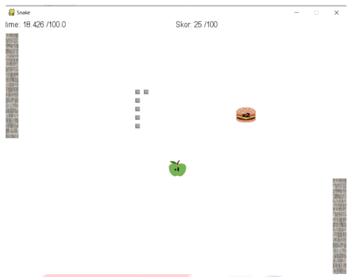
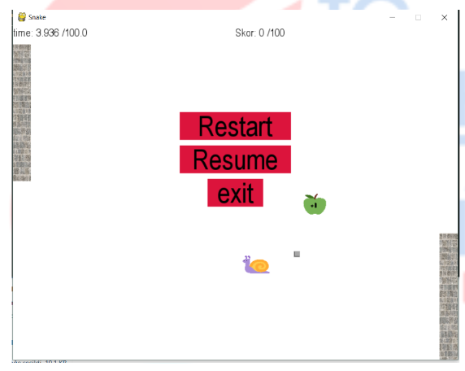
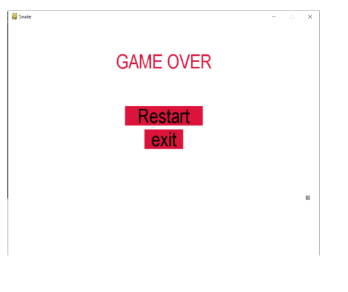

## Projenin amacı
Pygame kütüphanesi kullarak yılan oyunu tasarlamak.

## Proje Tasarımı 

	
## Projede Yapılanlar

* Yılan, elma, duvar ve menu classlarını oluşturup küçük gri image ekleyerek yılanın ilk karesi oluşturuldu. Oyun döngüsünün içerisine klavyede hangi tuşlara basılarak yılanın hareket ettirileceği belirlendi.

* Random x ve y değeri alınarak elma objesinin konumu belirlendi. Yılan objesinin elmaya çarpmasıyla tekrar elma objesi oluşturuldu. Yılanın boyunun uzaması için gerekli kod yazıldı ve boyunun uzayıp gitmemesi için sondan listeden silindi.

* Yılanın boyunu uzaltan, kısaltan, hızlandıran, yavaşlatan, öldüren yemler eklendi. Yemler random bir şekilde ekranda gösterildi.

* Ekranlar arasında geçiş yapabilmesi ve yılanın kendini yememesi sağlandı.

* İki elmanın üst üste gelmemesi ve duvara çarptığında oyunun sonlanması için gerekli kontroller yapıldı.

* Oyun sırasında escape tuşuna basıldığında ekranda Restart, Resume, Exit butonları olan bir menü eklendi. 

* Oyun bittiğinde ekranda Game Over yazısı, Restart ve Exit butonları eklendi. 
